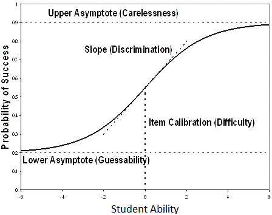

*This is Part 3 in my series on 'Understanding PARCC'. [Part 1](parcc.html) covered measuring ability and [Part 2](parcc_test.html) provided an overview of the PARCC test.*

#Introduction

Part 3 is an introduction to item response theory (IRT), which is the class of techniques that PARCC uses to calculate their scaled scores. You can skip this section if you already know how IRT models are calibrated. If you are a practitioner who is trying to interpret PARCC test scores, I would highly recommend a furrow-browed read of this section -- a deep understanding of what PARCC can and can't tell us is only possible if you have a conceptual understanding of the IRT models underlying the scores.

The basic idea of item response theory is that a student’s score on an item is combination of the student’s true ability and the features of that item. A foundational concept is the item characteristic curve (ICC), which plots student ability against the probability of answering an item correctly. Different characteristics of the shape of the line in the ICC are used as parameters in IRT models.

\

There are three foundational IRT models, and the difference between them is the test features they consider.

###The 1 parameter model considers the difficulty of the item

The difficulty of an item is likelihood that a student of a given ability would get an item correct. The idea is that an item is hard if only higher ability students get it correct, and easy if low ability students get it correct. Difficulty is a point on the item characteristic curve. In IRT calculations, difficulty is expressed as the level of ability that would have a 50% chance of getting the item correct (that is the value of x where y = 0.5 in the picture above).

###The 2 parameter model considers the difficulty and the discrimination of the item

The discrimination of an item refers to the ability of an item to different between students of different ability. Discrimination is the slope of the ICC at a given point. A steeper slope means that the item is more discriminatory -- students with slightly less ability would be much less likely to get the item correct, and students with slightly more ability would be much more likely to get the item correct. In IRT calculations, discrimination is (basically) the slope of the ICC at the difficulty parameter (that is, the slope of the line when y = 0.5) 

###The 3 parameter model considers the difficulty, discrimination and guessability or the item

The guessability is the chance that a student with no ability could guess the correct answer. It is most commonly used with multiple choice tests. In IRT calculations, the guessability is (basically) the lower asymptote of the ICC. 

##Interpretation of IRT Scores

One of the primary reasons that item response theory is popular is that, under certain assumptions, it will yield the same estimate of student ability if that student took a test that is easy or a test that is hard. On an easy test, we would adjust the values of difficulty and discrimination to match the characteristics of that test, allowing us to generate the same estimate of student ability as we would on a harder test.

Thus, PARCC can use item response theory to generate comparable scores for students who used different test forms, even though the test forms have different levels of difficulty. 

#PARCC's IRT Model

PARCC uses the 2 parameter model to generate test scores, with some modifications to allow for items that are worth more than one point (the basic model assumes that each item is worth 0 or 1 points). 

PARCC tested the three parameter model, but found that it wasn’t better. There are relatively few multiple choice items on PARCC and the guessability of PARCC items is low. 

Two bodies separately calibrated the IRT models used and a third body compared the results. It was an expensive, careful process. 

Calibration is difficult because the first time you estimate the model, you know neither the test parameters nor the underlying student ability. 

Calibration is therefore usually done iteratively. You assume some starting value for student ability, then estimate the test parameters, then use the estimated test parameters to estimate student ability, then using the student ability estimates to re-estimate the test parameters, and so on, until the improvements from additional re-estimation are small. 

There is randomness in the calibration process. Two calibrations can yield different results, and therefore different estimates of student ability. This is why PARCC was so careful about calibration -- they wanted to make sure that student scaled scores were not overly sensitive to the calibration process. 
