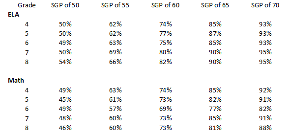

*This is Part 5 in my series on 'Understanding PARCC'. [Part 1](parcc.html) covered measuring ability and [Part 2](parcc_test.html) provided an overview of the PARCC test. [Part 3](parcc_irt.html) is an introduciton to Item Response Theory. [Part 4](parcc_scaledscore.html) reviewed how PARCC creates scaled scores.*

The Massachusetts Department of Elementary and Secondary Education (DESE) supplements the PARCC scaled score and levels with a variety of  metrics based off of the MCAS framework. 

#MCAS Scaled Score

MCAS scaled scores are even numbers between 200 to 280. Similar to PARCC, this range was chosen by DESE and has no inherent meaning. 

On MCAS, scaled scores are estimated using the 3 parameter item response theory model. MCAS repeats items from year-to-year and uses an anchoring technique to create a common scale over time (it is possible that PARCC could have switched to a method like this in 2016 now that they have multiple years of results). 

DESE does not perform their own IRT analysis of the PARCC data. 

Instead, scaled scores are calculated using “equipercentile linking”, which sounds much fancier than it is. Basically, DESE says: in a typical year, X% of students get a 280, so we’ll give the top X% of performers on PARCC a 280. The next Y% of students score 278, so we’ll give the next Y% of performers on PARCC a 278.

A student’s MCAS scaled score on PARCC is therefore a function of their percentile on PARCC. If the overall ability of the entire grade level across the state changed, it this change would not be reflected in the MCAS Scaled Score.

#MCAS Performance Levels

MCAS scaled scores are divided into four performance levels:

```{r, echo=FALSE}
example = data.frame(
  `Performance Level` = c("Warning", "Needs Improvement", "Proficient", "Advanced"),
  `Scaled Score Range` = c("200-218", "220-238", "240-258", "260-280" )
)

pander::pander(example, format="markdown", padding = 1)
```

It’s possible (likely?) that when MCAS was originally developed, they may have used a process similar to PARCC to set the cut scores relative to benchmarks of expert opinion. However, MCAS cut scores have been around for so long that they have become their own benchmark -- enough people are sufficiently familiar with MCAS performance levels that there is inherent meaning in a school being 75% Advanced / Proficient.

The percentage of students scoring advanced or proficient (% A/P) is a common school accountability metric used by districts and schools. The primary advantage of this metrics is its ease of interpretation: % A/P is the percent of students who are meeting state standards. 

However, the percent advanced/proficient is a very basic metric that has many drawbacks. For example:

- %A/P doesn't take into account a student's incoming levels. If a student was advanced in the previous year and proficient this year, the school would not be penalized, even though that student regressed. (SGP addresses this)
- %A/P doesn't penalize a school for having students who are very low performing. (CPI addresses this)
- %A/P doesn't reward a school for having students who are very high performing. (Average scaled score addresses this)

A consequence of these drawbacks is that %A/P accountability goals can lead to targeting of "bubble students". If a school is rewarded differentially for students just above the proficiency threshold, the school has an incentive to ignore students who are already above the threshold, or who are too low to have hope in reaching the threshold.

The interpretation of the MCAS performance levels is still relatively straightforward of PARCC: it is the percent of students in above the typical state standard percentile. 

#MCAS CPI

DESE reports a “composite performance index” (CPI) for all students. The cut scores for CPI values are 

```{r, echo=FALSE}
example = data.frame(
  `Performance Level` = c("Warning - Low", "Warning - High", "Needs Improvement - Low", "Needs Improvement - High", "Proficient or Advanced"),
  `Scaled Score Range` = c("200-208", "210-218", "220-238", "230-238", "240-280"),
  `CPI` = c(0, 25, 50, 75, 100)
)

pander::pander(example, format="markdown", padding = 1)
```

A school's average CPI is used more in state-level school accountability discussions than in student performance evaluation. CPI provides more information than its competitor metric, the % of student advanced or proficient (% A/P), because it penalizes schools for performance below proficient. 

CPI awards no bonus for students at advanced. A study of 10th grade MCAS showed that a very large percentage of students who score advanced go to college, so there is reason to believe that the percent of students at advanced is a meaningful piece of information.  

While the CPI provides more information than % A/P, it does not have the same intuitive meaning, and the interpretation of CPI is even more complicated with PARCC. In a PARCC world, CPI is best thought of as a unitless metric with a minimum of 0 and a maximum of 100.

#Student Growth Percentile 

The student growth percentile (SGP) is commonly associated with MCAS, but its calculation actually doesn’t depend on the test.

A student’s SGP is their percentile among all students with the same score history. That is, student performance is compared to all other students with the same history of scores, going back as far as possible. 

The median SGP for a classroom is a statistically valid value added measure -- it is a measure of how much the median student grew relative to all other students with the same score history. 

Indeed, [some researchers](https://www.aeaweb.org/articles?id=10.1257/aer.102.5.1805) actually prefer median SGP or related measures to more complicated value add models. 

Similarly, the median SGP for a school is a value add measure for that school and the median SGP for a district is a value add measure for the district. 

There are some drawbacks to median SGP as an accountability measure.

First, we care about all children, not just the median child, so an examination of the distribution of all SGPs for the classroom would yield more information. 

Second, student growth percentile does not take into account student characterics other than their test score history. Certain student characteristics may make them less likely to grow in the future, even after controlling for test score history. [For example](http://users.nber.org/~dynarski/w22474.pdf), with the same score history, students deep in poverty are less likely to improve in the future than students experiencing transient poverty. Thus, it may be more difficult to have a high SGP if you have many students in deep poverty. 

Nonetheless, SGP is an improvement over % A/P, CPI or % Meeting Expectations on PARCC, as it is a measure of learning rather than a cross section of performance. 

There is [very good evidence](http://www.rajchetty.com/chettyfiles/value_added.pdf) that students who have teachers with high value add scores have improved life outcomes, often dramatically so, even if the students were initially low performing and even if their scores later returned to a normal trajectory.

##What is a good SGP?

At the individual student level, a good SGP is easy to interpret: An SGP of 90 is the 90th percentile of growth, so you could set the ‘good’ cutoff based on whatever percentile you feel is good. 

As the sample size increases, however, the median SGP tends to converge to the population value, which, across the state, is 50. For example, if the state had one very large school district with all of the students in the state except for one, that district's median SGP would by definition be 50. Same if the district had every student except for 2 students. 

The more students you have, the harder it is to achieve a very high or very low SGP. 

A classroom with a median SGP of 90 would be higher than the 90th percentile of all classrooms. A grade level with a median SGP of 90 would be among the best grade levels in the state, and it’s nearly impossible for an entire school to have a median SGP of 90.

The tables below demonstrate how difficult it is for a school to get an outlier SGP. In ELA in 2015, a school with a median SGP of 50 would be in the 49th percentile of all schools. A 5 SGP point improvement to 55 would put the school in the top 69% of all schools -- a 20 percentage point improvement. In contrast, improving from 65 to 70 would yield only a 4 point improvement in the school’s percentile, from the top 93% of schools to the top 97% of schools. 

ELA - Percentile of a School with an SGP of 
```{r, echo = FALSE}
example <- tibble::frame_data(
  ~Year, ~`SGP of 50`, ~`SGP of 55`, ~`SGP of 60`, ~`SGP of 65`, ~`SGP of 70`,
  "2010", "48%", "64%", "83%", "91%", "96%",
  "2011", "49%", "65%", "82%", "91%", "96%",
  "2012", "48%", "68%", "82%", "91%", "96%",
  "2013", "48%", "66%", "81%", "92%", "97%",
  "2014", "49%", "68%", "81%", "91%", "96%",
  "2015", "49%", "69%", "83%", "93%", "97%"
)

pander::pander(example, format="markdown", padding = 1)
```


Math - Percentile of a School with an SGP of
```{r, echo = FALSE}
example <- tibble::frame_data(
  ~Year, ~`SGP of 50`, ~`SGP of 55`, ~`SGP of 60`, ~`SGP of 65`, ~`SGP of 70`,
  "2010", "46%", "62%", "79%", "90%", "95%",
  "2011", "48%", "64%", "78%", "88%", "93%",
  "2012", "47%", "64%", "77%", "88%", "94%",
  "2013", "41%", "57%", "73%", "85%", "92%",
  "2014", "48%", "64%", "78%", "89%", "96%",
  "2015", "49%", "65%", "80%", "91%", "96%"
)

pander::pander(example, format="markdown", padding = 1)
```

The table below shows a similar comparison for grade levels in 2015. As expected, it is somewhat easier to get a high SGP in a grade level than in a school. 

2015 MCAS - Percentile of a grade level with an SGP of 


Moreover, it is harder for a large school (or grade) to get a high SGP than a small school (or grade). The chart below shows that, on the 2014 Math MCAS, high SGPS for large schools are extraordinarily rare. (The high organge circle with ~450 students is UP Academy Boston and the high grey circle with ~850 students is Roxbury Prep). 

Math SGP versus Number of Students, 2014 MCAS

